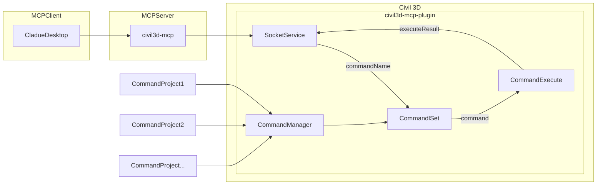

[](https://mseep.ai/app/revit-mcp-revit-mcp)

# civil3d-mcp

English | [简体中文](README_zh.md)

## Description

civil3d-mcp allows you to interact with Autodesk Civil 3D using the MCP protocol through MCP-supported clients (such as Claude, Cline, etc.).

This project is the server side (providing Tools to AI), and you need to use a Civil 3D MCP plugin (driving Civil 3D) in conjunction.

Join [Discord](https://discord.gg/cGzUGurq) | [QQ Group](http://qm.qq.com/cgi-bin/qm/qr?_wv=1027&k=kLnQiFVtYBytHm7R58KFoocd3mzU_9DR&authKey=fyXDOBmXP7FMkXAWjddWZumblxKJH7ZycYyLp40At3t9%2FOfSZyVO7zyYgIROgSHF&noverify=0&group_code=792379482)

## Features

- Allow AI to get data from the Civil 3D project
- Allow AI to drive Civil 3D to create, modify, and delete elements
- Send AI-generated code to Civil 3D to execute (may not be successful, successful rate is higher in some simple scenarios with clear requirements)

## Requirements

- nodejs 18+

> Complete installation environment still needs to consider the needs of the Civil 3D MCP plugin, please refer to its documentation.

## Installation

### 1. Build local MCP service

Install dependencies

```bash
npm install
```

Build

```bash
npm run build
```

### 2. Client configuration

**Claude client**

Claude client -> Settings > Developer > Edit Config > claude_desktop_config.json

```json
{
    "mcpServers": {
        "civil3d-mcp": {
            "command": "node",
            "args": ["<path to the built file>\\build\\index.js"]
        }
    }
}
```

Restart the Claude client. When you see the hammer icon, it means the connection to the MCP service is normal. (example shows Civil 3D, will be Civil 3D)


## Framework



## Supported Tools

| Name                               | Description                                                                                                |
| ---------------------------------- | ---------------------------------------------------------------------------------------------------------- |
| `get_drawing_info`                 | Retrieves basic information about the active Civil 3D drawing.                                             |
| `list_civil_object_types`          | Lists major Civil 3D object types available or present in the current drawing (e.g., Alignments, Surfaces). |
| `get_selected_civil_objects_info`  | Gets basic properties of currently selected Civil 3D objects. Can limit the number of returned objects.    |
| `create_cogo_point`                | Creates a new COGO (Coordinate Geometry) point in the Civil 3D drawing.                                    |
| `create_line_segment`              | Creates a simple line segment in the Civil 3D drawing.                                                     |
